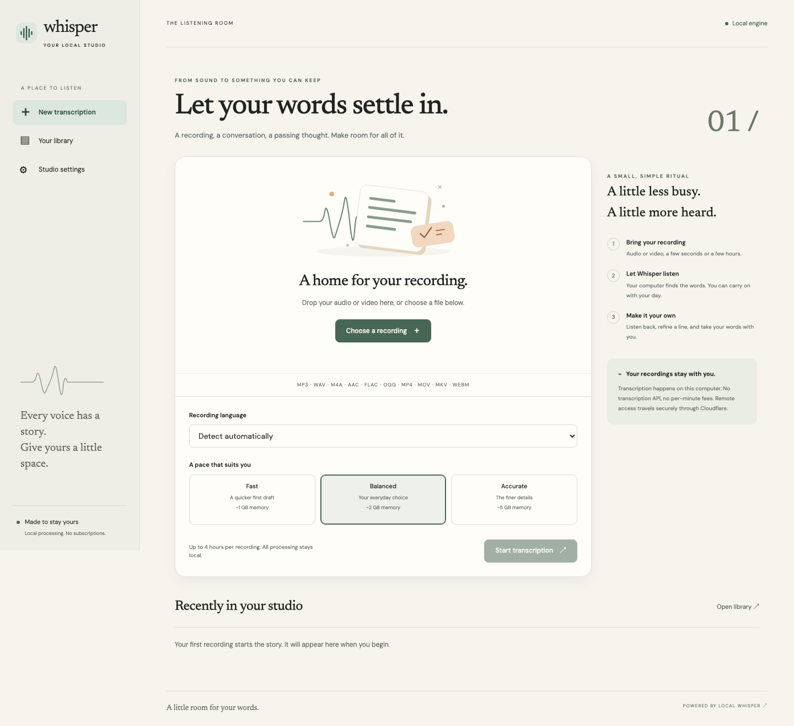

# Whisper Studio

Local audio and video transcription. Whisper Studio runs **FFmpeg, faster-whisper, SQLite, and its web server on your own computer**. Import recordings, edit transcripts, and export text or subtitles.

Built for `transcribe.bernardyamoah.com`, with a loopback recovery address at `http://127.0.0.1:8765`.



## Start locally

Requirements: macOS or Linux, Python 3.12/3.13 (managed by uv), [uv](https://docs.astral.sh/uv/getting-started/installation/), and FFmpeg. On macOS:

```sh
brew install uv ffmpeg
git clone https://github.com/bernardyamoah/local-whisper-transcription.git
cd local-whisper-transcription
uv sync --locked
uv run whisper-studio
```

Open **http://127.0.0.1:8765**. Go to **Settings**, choose **Install**, and confirm a model download. Then return to **New transcription** and choose an audio or video recording. The application never downloads an inference model automatically.

First installation requires internet access. After software and a model are installed, local transcription works offline. The installed application does not need Node.js; FastAPI serves the compiled client, CSS, SVGs, and fonts directly.

## Included

- Drag-and-drop uploads with streaming writes, checksums, actual container probing, duration limits, and upload progress.
- Searchable model manager with explicit installation, deletion, measured download progress, and support for official faster-whisper variants.
- Fast, Balanced, and Accurate presets, optional model override, and automatic or manual language selection.
- One durable background worker; persistent queue, stage progress, elapsed time, cancellation, retry, and interrupted-job recovery.
- Browser-compatible playback, timestamp seeking, segment following, volume and speed controls.
- Debounced autosave, original generated text preservation, revision conflict protection, search, session undo, and copy.
- TXT, SRT, and VTT export from saved edits; ordered, non-overlapping subtitle cues and safe filenames.
- Searchable/sortable, paginated library, retained source reuse, scoped deletion confirmations, and retention settings.
- Local diagnostics, rotating content-free logs, storage reporting, and offline connection messages.
- Loopback-only origin, host/origin checks, CSRF request headers, restrictive CSP, and signed Cloudflare Access JWT verification for the production hostname.
- Self-hosted DM Sans and Newsreader, keyboard controls, reduced-motion support, and desktop/tablet/mobile layouts.
- TanStack Start file-based routes, reusable React UI components, and restrained Motion transitions for dialogs and state changes.

## Configuration

Copy `.env.example` to `.env` and launch with:

```sh
uv run --env-file .env whisper-studio
```

`STUDIO_DATA` defaults to `~/.local/share/whisper-studio`. It contains the SQLite database, original recordings, MP3 playback derivatives, temporary files, models, and logs. Treat this entire directory as private. No media or models belong in Git.

`STUDIO_PORT` defaults to `8765`. `STUDIO_MODEL_FAST`, `STUDIO_MODEL_BALANCED`, and `STUDIO_MODEL_ACCURATE` default to `base`, `small`, and `medium`. Model mappings and environment variables require a restart. Supported mappings are the model identifiers accepted by faster-whisper; use safe identifiers without slashes. Displayed memory and download estimates describe the default mappings.

Language, quality, recording retention, maximum duration, and hardware are saved in the application. Hardware preferences apply to the next job. Apple Silicon uses optimized CPU int8 inference with this runtime; CUDA requires a compatible NVIDIA GPU and runtime libraries. Metal/MPS is not claimed or enabled.

## Private domain

The repository is ready for a Cloudflare Tunnel + Access deployment, but **creating a GitHub repository does not provision Cloudflare or make the hostname live**. Follow [the deployment guide](docs/DEPLOYMENT.md). Until an Access team domain, application audience, and owner email are configured, requests to the production hostname fail closed.

Never expose the origin with public port forwarding. Use the supplied launcher, which binds to loopback and prevents multiple instances from sharing a data directory.

## Development and verification

```sh
uv sync --locked
uv run ruff check studio tests
uv run ruff format --check studio tests
uv run pytest -q
npm ci
npm run typecheck
npm run build
npx playwright install chromium
npm run test:e2e
```

Backend and browser suites use real SQLite and FFmpeg with a deterministic subprocess engine. The fake engine exists only in the test launcher; there is no production configuration switch that can enable it. Browser tests cover import → processing → edits → reload → copy → exports → deletion, responsive layout, and automated accessibility checks.

For an optional real-engine test, explicitly download a small model and provide a short speech fixture:

```sh
uv run python -m studio.models tiny .data/integration/tiny
# macOS example: generate a local, non-sensitive speech fixture.
say -o .data/integration/speech.aiff "Every voice has a story. This recording stays on my computer."
ffmpeg -i .data/integration/speech.aiff .data/integration/speech.wav
STUDIO_TEST_MODEL="$PWD/.data/integration/tiny" STUDIO_TEST_AUDIO="$PWD/.data/integration/speech.wav" uv run pytest tests/test_real_engine.py -q
```

This optional model download is approximately 75 MB and connects to Hugging Face. Routine CI does not download models.

## Architecture

`src/` contains the TanStack Start SPA, file routes, React components, and Motion interactions. `studio/app.py` exposes the same-origin JSON API and serves the compiled client. `store.py` manages SQLite and confined paths. `media.py` validates imports with FFprobe. `jobs.py` owns all job state transitions and runs one subprocess at a time. `engine.py` isolates FFmpeg and Whisper; cancellation kills the complete process group. `models.py` handles explicit downloads. `exports.py` normalizes subtitle cues. `security.py` verifies the request boundary and permits only the generated inline bootstrap scripts by hash.

The server polls durable state; inference is independent of browser requests. Every SQLite connection enables foreign keys; write transactions protect edits and transcript creation. Schema version 1 uses `PRAGMA user_version`. A future schema change must add a migration before increasing it. Recordings stream to disk; the Whisper runtime may allocate normalized audio internally, so large-file memory acceptance still needs hardware-specific testing.

See [operations and recovery](docs/OPERATIONS.md), [validation and release status](docs/VALIDATION.md), and the [original PRD](docs/PRD.md).

## Current boundaries

This is an initial implementation, not a claim that every PRD 1.0 acceptance check has been completed. Production Access identity tests, a real Tunnel outage test, one-hour resource measurements, multilingual/noisy-audio quality checks, and CUDA verification require the deployment and target hardware. Remote uploads are subject to Cloudflare's request-size limit; use localhost for larger recordings. Uploads can be retried but do not resume partial transfers. There is no diarization, live transcription, or cloud inference.

Fonts are distributed under the SIL Open Font License; their licenses are bundled in `studio/static/fonts/`.
